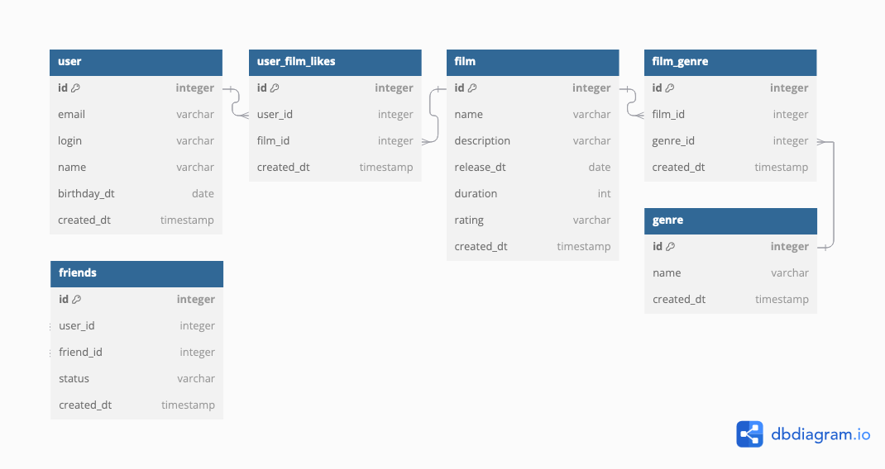

# Filmorate

Проект на java

Описание таблиц

Базовые таблицы:
user - пользователи,
film - фильмы,
genre - справочник жанров

Таблицы пересечений:
friends - связи "друзья" между двумя пользователями
user_film_likes - связи "лайк" между пользователем и фильмом
film_genre - связь фильма с жанрами

[Примеры SQL запросов](db/sql-example.sql)
